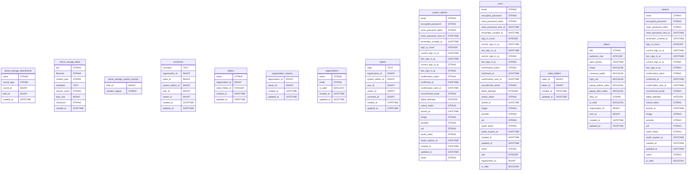

```mermaid
erDiagram
  active_storage_attachments {
    name STRING 
    record_type STRING 
    record_id BIGINT 
    blob_id BIGINT 
    created_at DATETIME 
  }
  active_storage_blobs {
    key STRING 
    filename STRING 
    content_type STRING 
    metadata TEXT 
    service_name STRING 
    byte_size BIGINT 
    checksum STRING 
    created_at DATETIME 
  }
  active_storage_variant_records {
    blob_id BIGINT 
    variation_digest STRING 
  }
  comments {
    comment TEXT 
    organization_id BIGINT 
    video_id BIGINT 
    system_admin_id BIGINT 
    user_id BIGINT 
    viewer_id BIGINT 
    created_at DATETIME 
    updated_at DATETIME 
  }
  folders {
    name STRING 
    organization_id BIGINT 
    video_folder_id INTEGER 
    created_at DATETIME 
    updated_at DATETIME 
  }
  organization_viewers {
    organization_id BIGINT 
    viewer_id BIGINT 
    created_at DATETIME 
    updated_at DATETIME 
  }
  organizations {
    name STRING 
    email STRING 
    is_valid BOOLEAN 
    created_at DATETIME 
    updated_at DATETIME 
  }
  replies {
    reply TEXT 
    organization_id BIGINT 
    system_admin_id BIGINT 
    user_id BIGINT 
    viewer_id BIGINT 
    comment_id BIGINT 
    created_at DATETIME 
    updated_at DATETIME 
  }
  system_admins {
    email STRING 
    encrypted_password STRING 
    reset_password_token STRING 
    reset_password_sent_at DATETIME 
    remember_created_at DATETIME 
    sign_in_count INTEGER 
    current_sign_in_at DATETIME 
    last_sign_in_at DATETIME 
    current_sign_in_ip STRING 
    last_sign_in_ip STRING 
    confirmation_token STRING 
    confirmed_at DATETIME 
    confirmation_sent_at DATETIME 
    unconfirmed_email STRING 
    failed_attempts INTEGER 
    unlock_token STRING 
    locked_at DATETIME 
    image STRING 
    provider STRING 
    uid STRING 
    oauth_token STRING 
    oauth_expires_at DATETIME 
    created_at DATETIME 
    updated_at DATETIME 
    name STRING 
  }
  users {
    email STRING 
    encrypted_password STRING 
    reset_password_token STRING 
    reset_password_sent_at DATETIME 
    remember_created_at DATETIME 
    sign_in_count INTEGER 
    current_sign_in_at DATETIME 
    last_sign_in_at DATETIME 
    current_sign_in_ip STRING 
    last_sign_in_ip STRING 
    confirmation_token STRING 
    confirmed_at DATETIME 
    confirmation_sent_at DATETIME 
    unconfirmed_email STRING 
    failed_attempts INTEGER 
    unlock_token STRING 
    locked_at DATETIME 
    image STRING 
    provider STRING 
    uid STRING 
    oauth_token STRING 
    oauth_expires_at DATETIME 
    created_at DATETIME 
    updated_at DATETIME 
    name STRING 
    role INTEGER 
    organization_id BIGINT 
    is_valid BOOLEAN 
  }
  video_folders {
    video_id BIGINT 
    folder_id BIGINT 
    created_at DATETIME 
    updated_at DATETIME 
  }
  videos {
    title STRING 
    audience_rate INTEGER 
    open_period DATETIME 
    range BOOLEAN 
    comment_public BOOLEAN 
    login_set BOOLEAN 
    popup_before_video BOOLEAN 
    popup_after_video BOOLEAN 
    data_url STRING 
    is_valid BOOLEAN 
    organization_id BIGINT 
    user_id BIGINT 
    created_at DATETIME 
    updated_at DATETIME 
  }
  viewers {
    email STRING 
    encrypted_password STRING 
    reset_password_token STRING 
    reset_password_sent_at DATETIME 
    remember_created_at DATETIME 
    sign_in_count INTEGER 
    current_sign_in_at DATETIME 
    last_sign_in_at DATETIME 
    current_sign_in_ip STRING 
    last_sign_in_ip STRING 
    confirmation_token STRING 
    confirmed_at DATETIME 
    confirmation_sent_at DATETIME 
    unconfirmed_email STRING 
    failed_attempts INTEGER 
    unlock_token STRING 
    locked_at DATETIME 
    image STRING 
    provider STRING 
    uid STRING 
    oauth_token STRING 
    oauth_expires_at DATETIME 
    created_at DATETIME 
    updated_at DATETIME 
    name STRING 
    is_valid BOOLEAN 
  }
```
